# Water Rocket with Ping-pong Ball Ejection Mission

A typical water rocket design designed to meet ping pong ball launch mission requirements.

1.5 L 페트병 하나를 동력원으로 **50 m 떨어진 목표 지점에 착탄**시키고, 비행 궤적상 **25 m 지점에서 탑재체(탁구공)를 사출**하는 물로켓을 설계·제작·발사한 팀 프로젝트입니다. CATIA로 구조와 사출 장치를 설계하고, MATLAB/Simulink와 OpenRocket으로 궤적·안정성을 예측한 뒤 실제 발사 결과와 비교해 오차 원인을 분석했습니다.

> 로켓공학및설계 (2026년 1학기) · 3인 팀 프로젝트

<p>
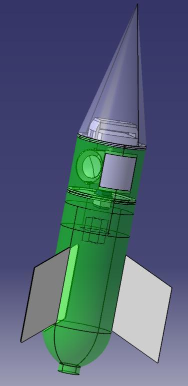
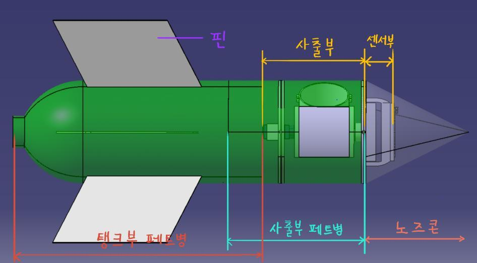
</p>

---

## 미션 요구사항과 결과

| 항목 | 시뮬레이션 예측 | 실제 비행 | 차이 |
|---|---|---|---|
| 발사각 / 물 주입량 / 압력 | 50° / 0.58 L / 50 psi | 50° / 0.58 L / 50 psi | – |
| 최대 비행거리 (목표 50 m) | 49.04 m | **56.6 m** | +7.56 m |
| 총 체공시간 | 3.16 s | 3.8 s | +0.64 s |
| 탁구공 사출 시점 | 1.548 s | 2.05 s | +0.50 s |
| 탁구공 사출 위치 (목표 25 m) | 25 m | **약 23.7 m** | −1.3 m |

<p>
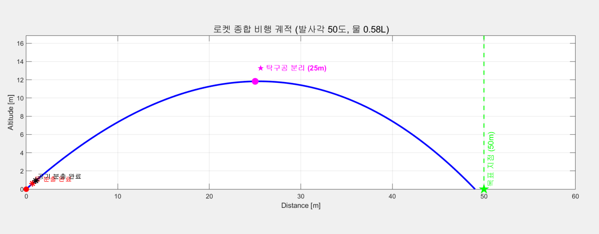
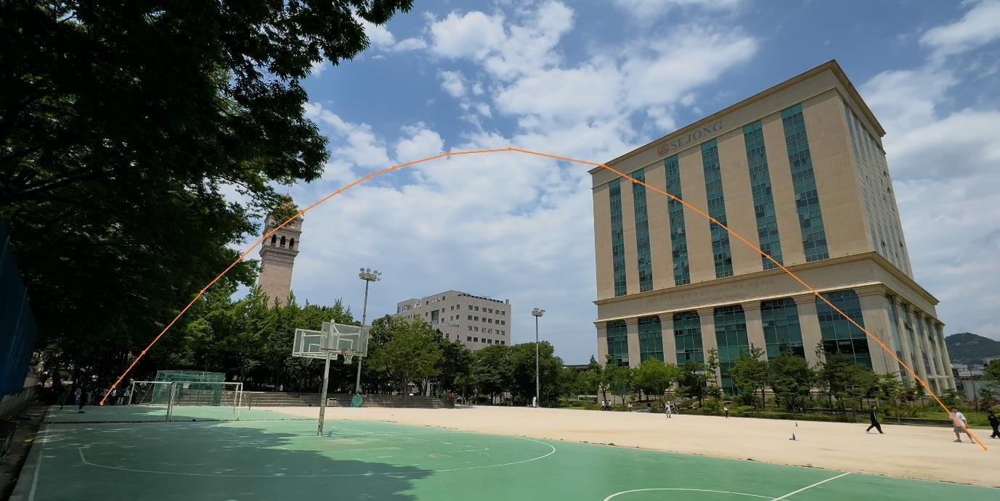
</p>

실제 비행 궤적과 사출 위치는 비행 중 BLE 통신 장애로 텔레메트리를 받지 못해 **촬영 영상을 프레임 단위로 분석해 복원**했습니다.

---

## 설계

### 1. 기체 구조와 비행 안정성

- **탱크부**: 칠성사이다 1.5 L 페트병을 가공하지 않고 사용했습니다. 50 psi에서 원주응력 38.81 MPa, 축응력 19.41 MPa로 PET 허용응력(약 89.7 / 66 MPa) 이내입니다. 반면 절단 후 접착하면 접합부 강도(테이프 0.154 MPa, 순간접착제 최대 4.2 MPa)가 부족해서 가공하지 않는 쪽을 택했습니다.
- **노즈콘**: 최대 속도 약 25 m/s(M ≈ 0.074)의 아음속이라 형상에 따른 항력 차이가 작습니다. 그래서 제작이 쉬운 원뿔형으로 하고, 직경 90 mm : 높이 180 mm(1 : 2)로 정했습니다. 소재는 경량 PP(클리어 파일)입니다.
- **무게중심 / 압력중심**: 부품별 실측 질량을 CATIA *Apply Material*에 밀도로 반영해 CG를 구했고(노즈콘 끝에서 **256.9 mm**), OpenRocket에서 CG를 override해 CP를 계산했습니다.
  - 물 0.58 L를 채운 직후에는 정적 마진이 −0.997 cal입니다. 다만 동압이 거의 0이고 물이 약 0.1 s 안에 모두 분사되기 때문에 영향이 작다고 판단했습니다.
  - 비행 중 안정 마진은 **0.243 ~ 0.276 cal**로, 전 구간에서 양수를 유지했습니다.

<p>
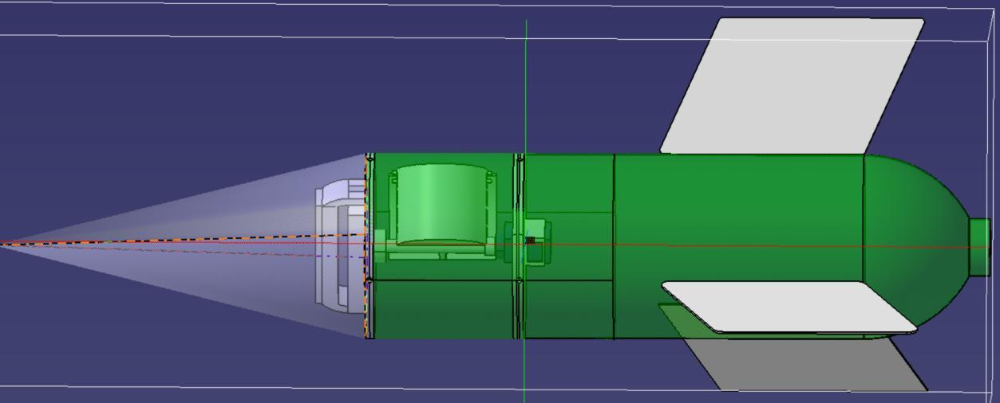
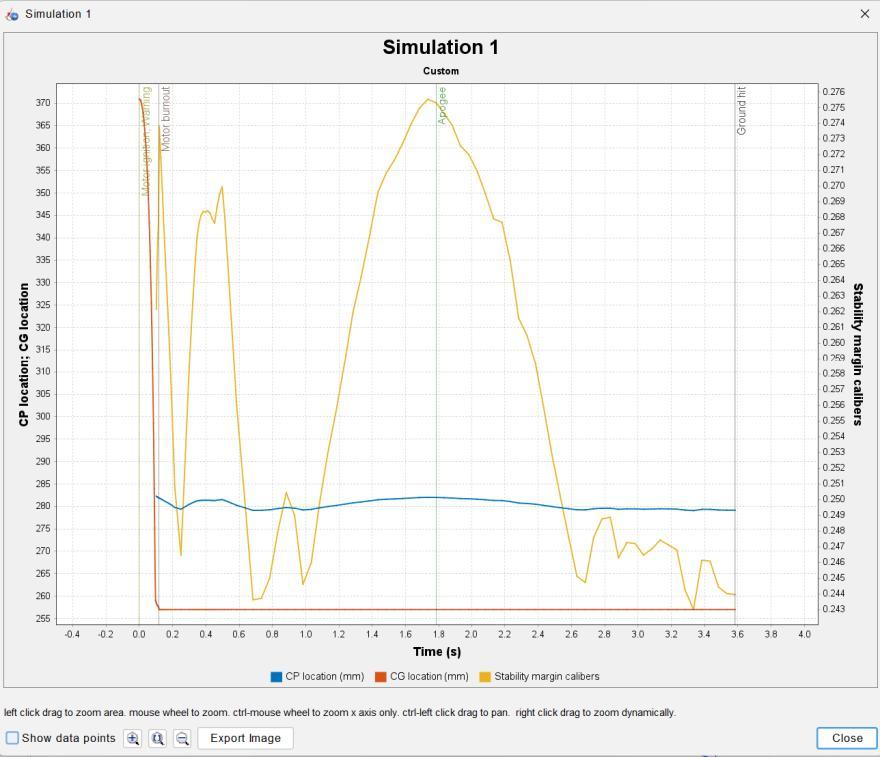
</p>

### 2. 탁구공 사출 장치

두 가지 안을 설계했습니다.

| | 1안: 링크식 개폐문 + 스프링 | 2안(최종): 회전 실린더 + 슬링샷 |
|---|---|---|
| 방식 | 서보 → 평행 링크로 양쪽 문을 열고 스프링으로 밀어냄 | SG90 서보가 실린더를 회전시키면 고무줄에 걸린 Pusher Pad가 탁구공을 튕겨냄 |
| 결과 | 부품이 많고 작동 시간이 길어 **폐기** | 구조가 단순하고 가벼워 **채택** |
| CAD | [`cad/design_v1_link_door`](cad/design_v1_link_door) | [`cad/design_v2_final`](cad/design_v2_final) |

<p>
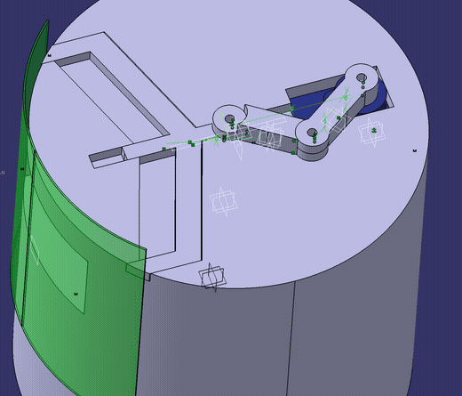
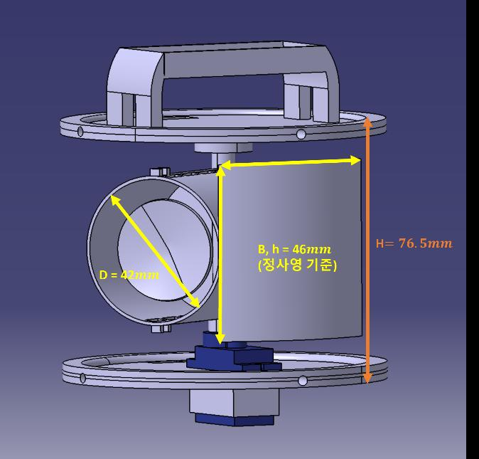
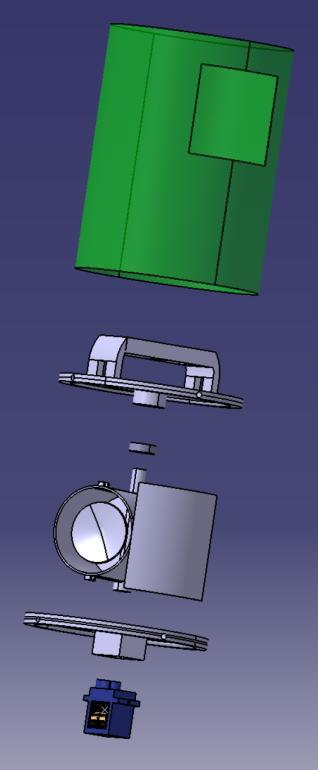
</p>

- 상판, 하판, 회전 실린더는 PLA+로 3D 프린팅했고, 상단 회전축에 베어링을 넣어 서보 출력에 따라 부드럽게 회전하도록 했습니다.
- 사출 지연 시간 예측값은 160.7 ms(고무줄 + 서보 + 전자장비 합산)입니다. 240 fps 슬로모션으로 측정한 값은 **167 ms**로, 예측과 7 ms 차이였습니다.

### 3. 비행 제어 및 데이터 수집 (Arduino Nano 33 BLE Sense)

IMU(가속도계·자이로)를 내장한 Arduino Nano 33 BLE Sense가 비행 컨트롤러 역할을 합니다. 로켓의 자세와 이동거리를 실시간으로 추정해 사출 서보를 구동하고, 비행 데이터는 BLE로 지상국(GCS)에 보냅니다. 상세 내용은 **[비행 소프트웨어 설계 문서](docs/flight_software.md)**에 정리했습니다.

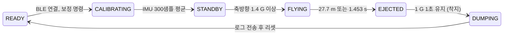

- **항법**: 자이로 적분으로 피치를 추정하고, 중력과 바이어스를 뺀 합성 가속도를 이중적분해 이동거리를 구합니다. 드리프트를 막기 위해 데드밴드 0.20을 적용했습니다.
- **사출 트리거**는 둘 중 먼저 만족하는 조건입니다.
  1. 추정 이동거리 **27.7 m** 도달 (직선 25 m에 해당하는 포물선 궤적 길이)
  2. 비행 시간 **1.453 s** 경과 (fail-safe)
- **데이터**:
  - 50 Hz로 최대 120 샘플을 RAM 버퍼에 저장합니다.
  - 착지 후 float을 int16으로 압축한 바이너리 패킷을 BLE로 보냅니다.
  - HTML 지상국 콘솔에서 로그를 받습니다.

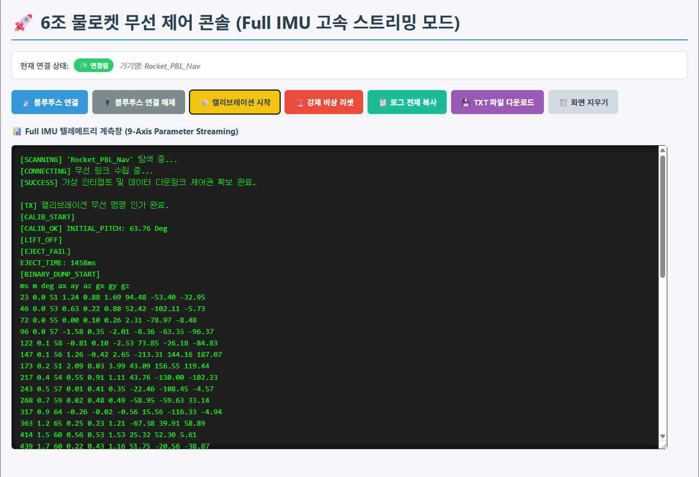

---

## 오차 원인 분석

1. **배풍 효과**: 발사 당시 서풍 3 m/s가 불어 상대속도 기준 항력이 줄었고, 그만큼 비행거리가 늘었습니다.
2. **유량계수 과소평가**: 물/공기 유량계수를 1.0으로 두고 다시 계산하면 실제 비행거리와 0.5% 이내로 일치합니다. 다른 요인이 복합적으로 작용했다는 뜻으로 해석했습니다.
3. **사출 시스템 지연**: MCU 처리 시간과 서보 구동 지연이 시뮬레이션에 완전히 반영되지 않았습니다.
4. **발사 감지 지연**: 축방향 가속도 1.4 G를 넘어야 발사로 판정하기 때문에, 실제 발사 시각보다 늦게 타이머가 시작되었습니다. 그 결과 fail-safe 1.453 s 조건이 2.05 s에 작동했습니다.

---

## 시뮬레이션

<p>
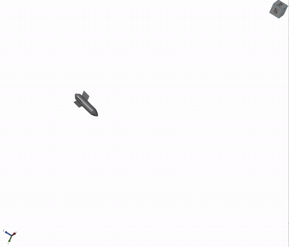
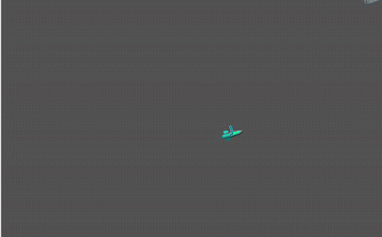
</p>
<p align="center"><sub>Simscape Multibody 6-DOF 비행 시뮬레이션 (<code>simulator_real.slx</code>, Mechanics Explorer)</sub></p>

| 파일 | 내용 |
|---|---|
| [`simulation/matlab/rocket3d_params.m`](simulation/matlab/rocket3d_params.m) | 추진·열역학·질량·CG·관성·공력 파라미터 (CATIA 측정값) |
| [`thrust_phase_func.m`](simulation/matlab/thrust_phase_func.m) | 물 분출 → 공기 분출 → 탄도비행 3단계 추력/질량유량 모델 (폴리트로픽 팽창) |
| [`aero_func.m`](simulation/matlab/aero_func.m) | Barrowman 선형화 3D 공력 모델 (항력 + 법선력 + 복원 모멘트) |
| [`mass_cg_inertia.m`](simulation/matlab/mass_cg_inertia.m) | 잔여 물 질량에 따른 질량·CG·관성텐서 보간 |
| [`stability_margin_timehistory.m`](simulation/matlab/stability_margin_timehistory.m) | 추력 구간 CG(t)–CP 안정 여유 시간이력 (단독 실행 스크립트) |
| [`water_simul.slx`](simulation/matlab/water_simul.slx) | Simulink 추력 모델 |
| [`simulator_real.slx`](simulation/matlab/simulator_real.slx) | Simscape Multibody 6-DOF 물로켓 모델 (**Simscape Multibody 필요**) |
| [`simulation/openrocket/water_rocket.ork`](simulation/openrocket/water_rocket.ork) | OpenRocket 모델. 물 0.58 L 추력곡선은 `motor/WaterRocket_0p58L.eng`로 불러오기 |

`mass_cg_inertia.m`은 `simulator_real.slx` 안의 MATLAB Function 블록 코드를 꺼낸 파일입니다. `stability_margin_timehistory.m`을 단독으로 실행할 때 필요합니다.

---

## 폴더 구조

```
Water-rocket-with-Pingpong-ball-ejection-mission/
├── cad/
│   ├── design_v2_final/        # 최종 기체 + 회전 실린더 사출 장치 (rotation_axis.CATProduct)
│   ├── design_v1_link_door/    # 1안: 링크식 개폐문 사출 장치 (link_dmu / ejection_assembly.CATProduct)
│   └── exports/                # 전체 기체 STEP·STL (zip)
├── simulation/
│   ├── matlab/                 # 추력·공력·질량 모델, Simulink / Simscape 모델
│   └── openrocket/             # .ork, 물로켓 추력곡선(.eng/.rse), CP-받음각 데이터
├── analysis/rubber_band_ansys/ # 슬링샷 고무밴드 ANSYS Workbench 해석
├── docs/
│   ├── flight_software.md      # 아두이노 비행 소프트웨어 설계 (FSM, 항법, 사출, 데이터 덤프)
│   ├── reports/                # 최종 보고서, PBL 개념설계(사출 메커니즘)
│   └── images/
└── coursework/nozzle_design/   # (같은 과목 개인과제) Bell vs Cone 노즐 설계, NASA CEA 분석
```

### CATIA 파일 열기

- CATIA V5에서 어셈블리(`.CATProduct`)를 열 때 파트 링크를 찾지 못하면 **File → Desk → Find**로 해당 폴더를 지정하면 다시 연결됩니다.
- `Arduino nano.CATPart`, `SG90 servomotor.CATPart`는 GrabCAD에 공개된 STEP 모델을 CATIA로 변환해 질량을 입힌 파일입니다.

## 보고서

- [로켓공학및설계 최종보고서](docs/reports/로켓공학및설계_최종보고서_6조.pdf)
- [비행 소프트웨어 설계 문서](docs/flight_software.md)
- [PBL 개념설계: 탁구공 사출 메커니즘](docs/reports/PBL_개념설계_탁구공_사출메커니즘.pdf)
- 개인과제: [노즐 설계 보고서 (Bell vs Cone)](coursework/nozzle_design/노즐_설계_보고서_Bell_vs_Cone.pdf) · [CEA 분석 보고서 (Equilibrium vs Frozen)](coursework/nozzle_design/CEA_분석_보고서_Equilibrium_vs_Frozen.pdf)
