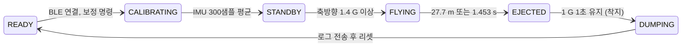

# 비행 소프트웨어 설계 (Arduino Nano 33 BLE Sense)

물로켓의 비행 제어와 데이터 수집 소프트웨어 구조를 최종 보고서 내용만으로 정리한 문서입니다. 펌웨어 소스 코드는 포함하지 않습니다.

---

## 1. 하드웨어 구성

| 구성품 | 역할 |
|---|---|
| **Arduino Nano 33 BLE Sense** | 가속도계·자이로스코프가 통합된 IMU 기반 비행 컨트롤러(FC). 자세·이동거리 추정, 사출 판단, BLE 통신 |
| **SG90 서보모터** | 회전 실린더를 돌려 개폐문을 열고 탁구공을 슬링샷으로 사출 |
| **배터리 & 소켓** | 전원 (사출 장치 상단 공간에 장착) |
| **지상국(GCS)** | 웹 브라우저에서 동작하는 HTML BLE 콘솔 |

SD 카드 같은 내부 저장장치는 **발사체 질량을 줄이기 위해** 빼고, 모든 데이터를 BLE로 받도록 설계했습니다.

---

## 2. 유한 상태 기계 (FSM)



| # | 상태 | 동작 |
|---|---|---|
| ① | `STATE_READY` | 하드웨어를 초기화하고 BLE 연결을 기다립니다. |
| ② | `STATE_CALIBRATING` | 정지 상태의 IMU 샘플 **300개**를 모아 초기 피치와 센서 바이어스를 계산합니다. |
| ③ | `STATE_STANDBY_DELAY` → `STATE_STANDBY` | 보정 직후 무선 통신 안정화를 위해 **500 ms 가드 타임**을 둔 뒤 발사 충격을 감시합니다. 축방향 가속도가 **1.4 G** 이상이면 발사로 판정합니다. |
| ④ | `STATE_FLYING` | 가속도·자이로로 이동거리를 실시간 계산하고 사출 조건을 감시합니다. |
| ⑤ | `STATE_EJECTED` | 서보를 구동해 탑재체를 사출하고, 착지할 때까지 충격 변화를 감시합니다. |
| ⑥ | `STATE_DUMPING` | RAM 버퍼에 쌓인 비행 데이터를 BLE 고속 패킷으로 전송하고 시스템을 리셋합니다. |

---

## 3. 비행 거리 추정 알고리즘

### ① 초기 자세와 센서 오차 (CALIBRATING)

지면에 정지한 상태에서 수집한 300개 샘플의 평균 $\overline{a}$를 씁니다.

```math
\theta_\text{init} = \operatorname{atan2}\!\left(\overline{a_{z,\text{raw}}},\ \overline{\sqrt{a_{x,\text{raw}}^2 + a_{y,\text{raw}}^2}}\right),
\qquad
\text{Bias}_z = \left(\overline{a_{z,\text{raw}}} - \sin\theta_\text{init}\right) g
```

### ② 비행 중 피치 추정 (FLYING)

정적 상태를 벗어나면 가속도로는 자세를 알 수 없습니다. 그래서 Y축 자이로를 시간에 대해 적분해 기울기를 갱신합니다.

```math
\theta_\text{current} = \theta_\text{prev} + \left(-\omega_y - \text{Bias}_{\omega_y}\right)\,dt
```

### ③ 3차원 동적 합성 가속도

원시값(g 단위)을 m/s²로 바꾸고, 추정 기울기에 해당하는 중력 성분과 바이어스를 빼서 **추력에 의한 가속도**만 남깁니다.

```math
a_x = a_{x,\text{raw}}\,g,\qquad
a_y = a_{y,\text{raw}}\,g,\qquad
a_z = \left(a_{z,\text{raw}} - \sin\theta_\text{current}\right) g - \text{Bias}_z
```

```math
a_\text{horizontal} = \sqrt{a_x^2 + a_y^2 + a_z^2}
```

### ④ 이중 적분으로 속도·거리 추정

```math
v(t) = v(t-dt) + a_\text{horizontal}\,dt,\qquad
s(t) = s(t-dt) + v(t)\,dt
```

- **노이즈 가드**: 가속도가 데드밴드(`ACCEL_DEADBAND = 0.20`)보다 작으면 정지로 보고 0으로 처리해 센서 드리프트를 1차로 억제합니다.
- 계산된 거리는 지구좌표계의 직선거리가 아니라 **궤적을 따라간 거리**입니다. 그래서 직선 25 m에 해당하는 포물선 궤적 길이인 **27.7 m**를 목표 거리로 정했습니다.

---

## 4. 사출 트리거

미션 실패를 막기 위해 두 조건 중 **먼저 만족하는 쪽**에서 서보에 신호를 보냅니다.

| 조건 | 값 | 목적 |
|---|---|---|
| 추정 이동거리 | **27.7 m** | 주 조건: 궤적상 25 m 지점 |
| 비행 시간 | **1.453 s** | fail-safe: 비행 시간이 짧고, 진동 같은 외란으로 거리 추정이 틀릴 경우에 대비 |

### 사출 지연 보정

| 구성 | 값 |
|---|---|
| 개념설계 예측: $t_\text{rubber} + t_\text{servo} + t_\text{elec}$ | 160.7 ms |
| 실측 (240 fps 슬로모션, 신호 → 탁구공 이탈) | **167 ms** (± $t_\text{elec}$ = 33.5 ms → 133.5 ~ 210.5 ms) |

- 예측과 실측 차이는 7 ms였습니다.
- 25 m 상공에서 33.5 ms가 만드는 거리 오차는 수 cm 수준이라 무시했습니다.
- 펌웨어에는 **167 ms 지연을 미리 빼서** 반영했습니다.

---

## 5. 데이터 저장과 덤프

| 항목 | 내용 |
|---|---|
| 로깅 주기 | 20 ms (**50 Hz**) |
| 버퍼 | RAM 배열, 최대 **120 샘플** (`MAX_LOG_SAMPLES`) |
| 착지 판정 | 사출 후 3축 가속도 크기 $\sqrt{a_x^2+a_y^2+a_z^2}$가 **1.0 G 부근에서 1000 ms** 유지 |
| 전송 방식 | 문자열 대신 구조체를 1바이트 배열로 직렬화한 **바이너리 패킷** (`bleWriteBinary`) |
| 압축 | float 값에 10 또는 100을 곱해 **int16**으로 전송 |
| 로그 형식 | `ms, m, deg, ax, ay, az, gx, gy, gz` (시간, 거리, 피치, 3축 가속도, 3축 각속도) |

### 지상국 (HTML BLE 콘솔)


- 상단 버튼: 블루투스 연결/해제, 캘리브레이션 시작, 강제 비상 리셋, 로그 전체 복사, TXT 파일 다운로드, 화면 지우기
- 하단 창: 로켓의 현재 상태(`CALIB_START`, `CALIB_OK`, `LIFT_OFF`, `EJECT_*`, `BINARY_DUMP_START`)와 비행 로그를 표시

---

## 6. 실제 운용 결과와 한계

| 항목 | 결과 |
|---|---|
| 지상 시험 | 사출 장치와 초기 시스템 구동은 정상이었고, 사양상 통신거리도 목표치(50~100 m)를 만족했습니다. |
| 실제 발사 | BLE 통신 장애로 유효 통신거리가 크게 줄어 비행 중 데이터를 안정적으로 받지 못했습니다. 대신 **촬영 영상을 프레임 단위로 분석**해 궤적과 사출 시점을 복원했습니다. |
| 사출 시점 | 설계 fail-safe는 1.453 s인데, 실제로는 **2.05 s(약 23.7 m 지점)**에 사출됐습니다. |

**원인 분석**
- fail-safe 조건만 있었다면 사출이 1.453 s를 넘을 수 없습니다.
- 그런데 2.05 s에 사출됐다는 건 **발사 시각을 늦게 인식**했다는 뜻입니다.
- 축방향 가속도가 1.4 G를 넘어야 발사로 판정하는 구조라서, 발사 → 감지 → 시간 측정 사이에 지연이 생긴 것으로 분석했습니다.
- MCU 처리 시간과 서보·개폐문의 기계적 지연도 시뮬레이션에 완전히 반영되지 않았습니다.
